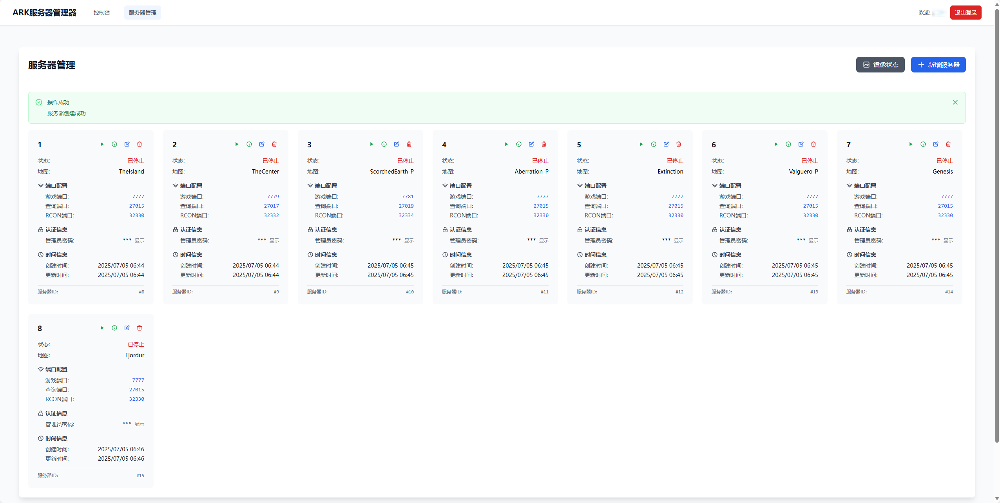
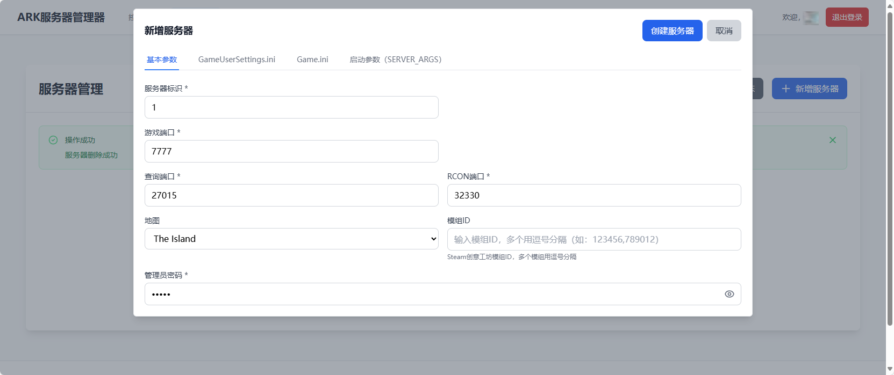
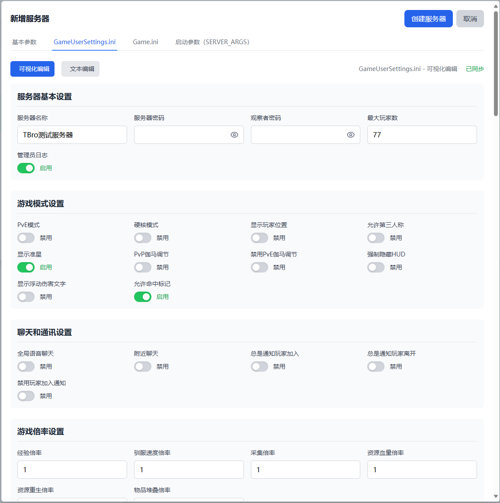
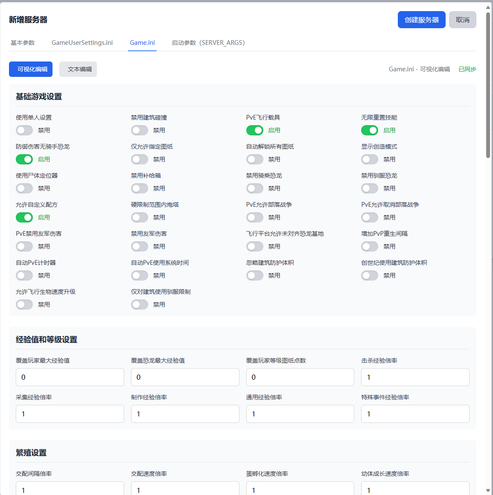
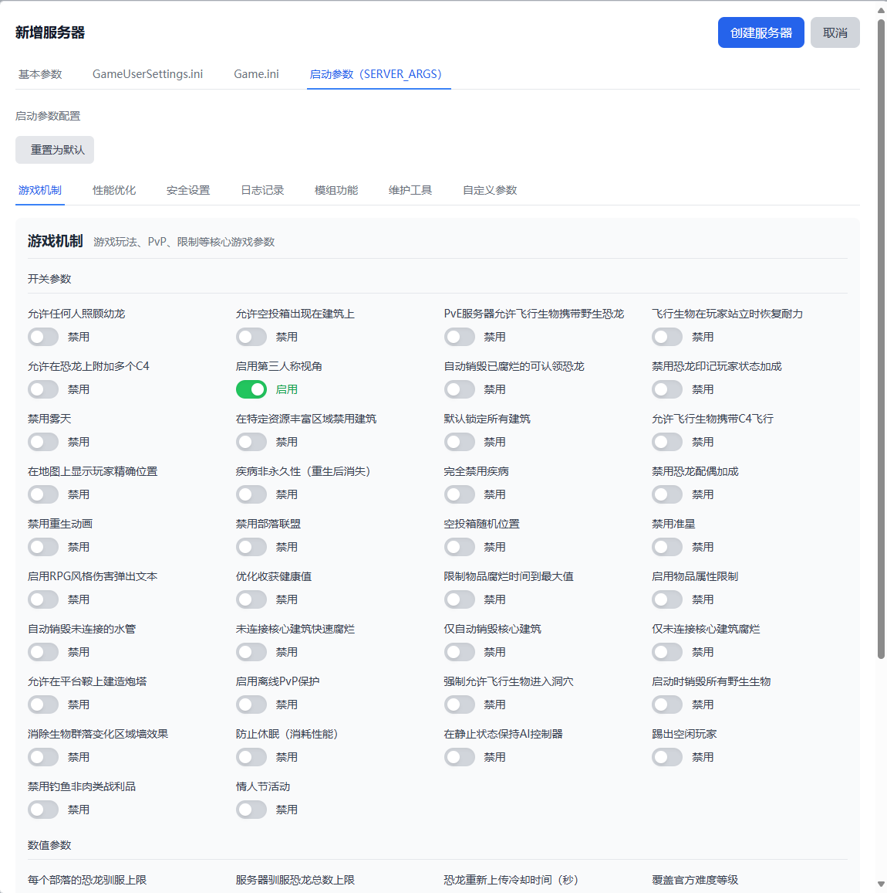

# ARK 服务器管理器

> ⚠️ **开发阶段提示**：本项目目前仍处于开发阶段，功能可能不完整或存在稳定性问题。建议仅用于测试环境，不建议在生产环境中使用。

[English](README.md) | [中文](README-zh.md)

- Linux上的 ARK 生存进化服务器管理工具。
- ARK 服务器自带 ArkApi 插件系统。

## 🎮 功能特性

### ✅ 已实现功能
- 🐳 每个ARK服务器运行在独立的Docker容器中
- 🔌 服务器自带ArkApi
- 🔄 服务器容器支持奔溃自动重启
- ⬆️ 第一次启动时自动更新服务端文件和Mod
- 💾 自动创建和管理Docker卷存储游戏数据
- 🖥️ 添加和管理多个 ARK 服务器
- ⚙️ 配置服务器设置和配置参数
- ▶️ 一键启动/停止服务器

### 🚧 待实现功能
- 🖼️ 服务器镜像更新
- 🎮 RCON 命令执行
- 📊 服务器运行状态监控
- 🎨 Mod管理对接steam创意工坊
- 🔧 ArkApi插件管理
- 📋 服务器日志查看
- 💾 服务器存档及配置备份
- 🔍 工具版本更新检查
- ⚡ 可选更新服务端文件和Mod
- 🌐 i18n 国际化支持
- 🔌 MCP 支持
  
### 🚀 未来计划
- ☸️ 多主机管理，可能基于K8S实现
- 🌍 服务器收录网站，脱离糟糕的steam搜服
- 👥 玩家使用界面

## 🚀 快速开始

### 🔧 系统要求

- 每个ARK服务器 8GB+ 内存 (推荐)
- 每个ARK服务器 10GB+ 磁盘空间

### 📦 安装 1Panel
推荐在服务器上安装1Panel来管理docker环境
[1Panel安装文档](https://1panel.cn/docs/v2/installation/online_installation/)

### 🐳 Docker容器化部署

拷贝docker-compose.yml，或直接复制
```yml
version: '3.8'

services:
  # ARK服务器管理系统 (前后端一体)
  ark-commander:
    image: tbro98/arkservercommander:latest
    container_name: ark-commander
    ports:
      # 可修改端口映射
      - "8080:8080"
    environment:
      # 后续优化，目前先保持默认
      - JWT_SECRET=your-secret-key-here
      - DB_PATH=/data/ark_server.db
      - SERVER_PORT=8080
    volumes:
      # 数据库存储
      - ./data:/data
      # Docker socket (用于管理Docker容器)
      - /var/run/docker.sock:/var/run/docker.sock
    restart: unless-stopped
    # 系统需要操作宿主机Docker的特权模式
    privileged: true

```

# 🚀 启动服务
```
sudo docker-compose up -d
```

🌐 通过 ip+端口，访问系统界面

## 📖 使用说明

### 🆕 首次使用
1. 系统会自动跳转到初始化页面
2. 设置您的管理员账号和密码
3. 初始化完成后登录系统

### 🖥️ 管理服务器
1. 登录后点击"服务器管理"
2. 点击"添加服务器"创建新的服务器配置

### 🗺️ 支持的地图 - 后续可扩展自定义增加
- The Island (孤岛)
- The Center (中心岛)
- Scorched Earth (焦土)
- Aberration (畸变)
- Extinction (灭绝)
- Valguero (瓦尔盖罗)
- Genesis (创世纪)
- Crystal Isles (水晶岛)
- Genesis 2 (创世纪2)
- Lost Island (失落岛)
- Fjordur (峡湾)

## ❓ 常见问题

### ❓ Q: 如何备份ARK服务器数据？
A: 暂时还没实现服务器数据的备份操作。服务器数据存储在Docker卷ark-server-<服务器编号>中，可以自行备份。

### ❓ Q: 如何查看ARK服务器日志？
A: 服务端程序目前无法直接在docker的logs中输出，需要查看服务器的日志文件，后续查看该怎么优化。


### 🖼️ ARK服务器镜像
- 本系统使用 `tbro98/ase-server:latest` 镜像来运行ARK服务器
- 镜像源地址: [ASE-Server-Docker](https://github.com/tbro199803/ASE-Server-Docker)

## 📸 界面展示




 