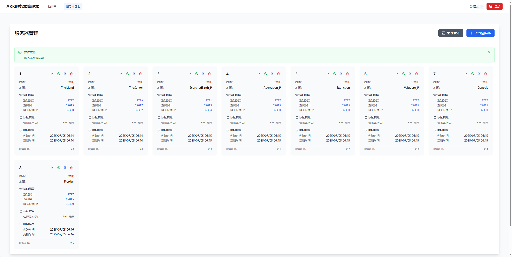
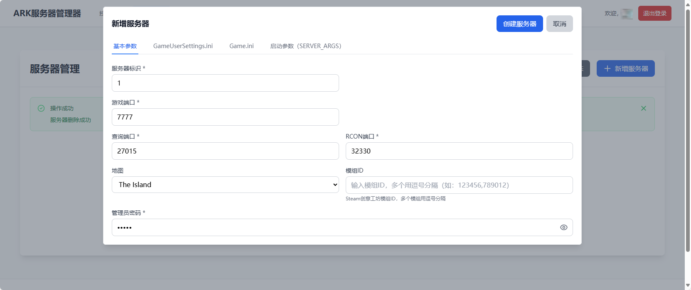
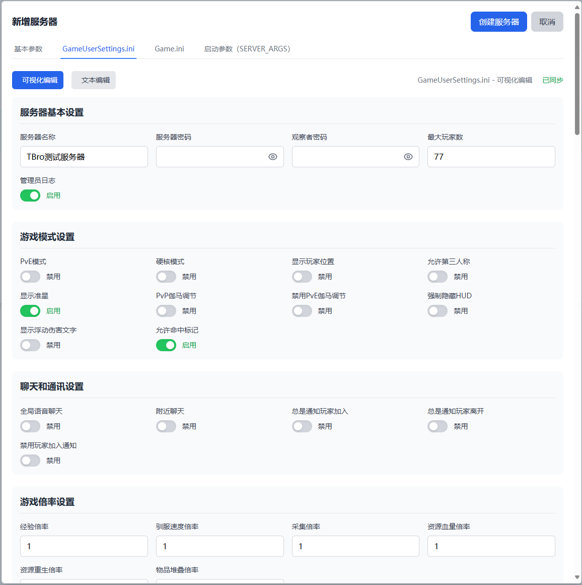
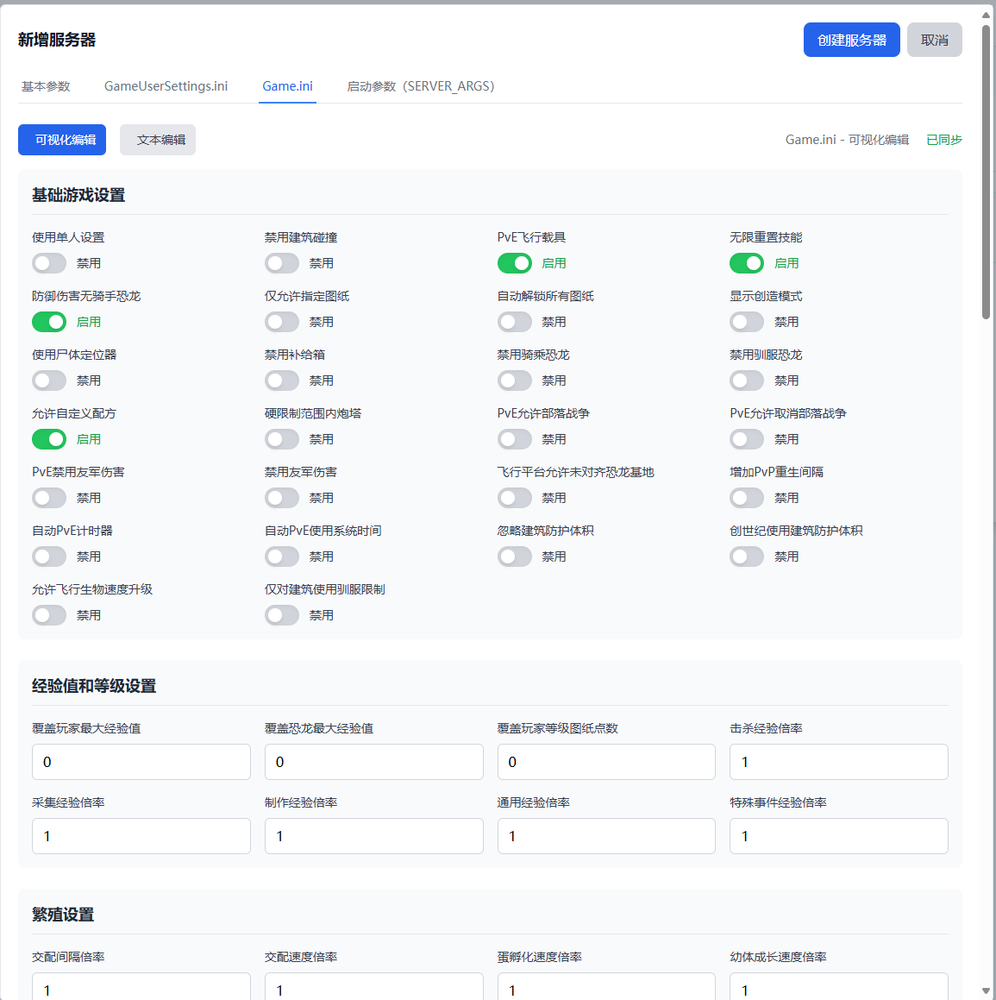
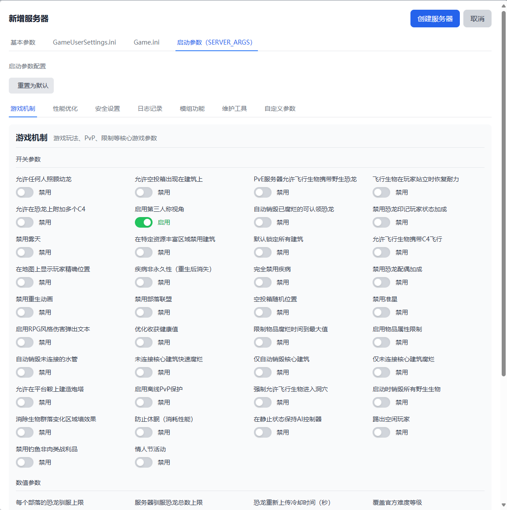

# ARK 服务器管理器

一个简单易用的 ARK 生存进化服务器管理工具，帮助您轻松管理和配置 ARK 服务器。

## 🎮 功能特性

### Docker容器化管理
- 🐳 每个ARK服务器运行在独立的Docker容器中
- 📦 自动创建和管理Docker卷存储游戏数据
- 🔄 容器状态实时同步
- 🛡️ 隔离的运行环境，提高安全性和稳定性
- 🖥️ 添加和管理多个 ARK 服务器
- ⚙️ 配置服务器设置（端口、地图、玩家数量等）
- 📝 在线编辑服务器配置参数
- ▶️ 一键启动/停止服务器
- 🗑️ 安全删除服务器配置和数据

### 待实现功能
- RCON 命令执行
- Mod管理
- 服务器存档及配置备份
- 系统更新检查
- 服务器镜像更新


## 🚀 快速开始

### Docker容器化部署（推荐）

拷贝docker-compose.yml，或直接复制
```yml
version: '3.8'

services:
  # ARK服务器管理系统 (前后端一体)
  ark-manager:
    image: tbro98/arkservermanager:latest
    container_name: ark-manager
    ports:
      # 可修改端口映射
      - "8080:8080"
    environment:
      # 后续优化，目前先保持默认
      - JWT_SECRET=your-secret-key-here
      - DB_PATH=/data/ark_server.db
      - SERVER_PORT=8080
    volumes:
      # 数据库存储
      - ./data:/data
      # Docker socket (用于管理Docker容器)
      - /var/run/docker.sock:/var/run/docker.sock
    restart: unless-stopped
    # 系统需要操作宿主机Docker的特权模式
    privileged: true

```

# 启动服务
```
docker-compose up -d
```

通过 ip+端口，访问系统界面

## 📖 使用说明

### 首次使用
1. 系统会自动跳转到初始化页面
2. 设置您的管理员账号和密码
3. 初始化完成后登录系统

### 管理服务器
1. 登录后点击"服务器管理"
2. 点击"添加服务器"创建新的服务器配置

### 支持的地图 - 后续可扩展自定义增加
- The Island (孤岛)
- The Center (中心岛)
- Scorched Earth (焦土)
- Aberration (畸变)
- Extinction (灭绝)
- Valguero (瓦尔盖罗)
- Genesis (创世纪)
- Crystal Isles (水晶岛)
- Genesis 2 (创世纪2)
- Lost Island (失落岛)
- Fjordur (峡湾)

## ❓ 常见问题

### Q: 无法访问管理界面？
A: 请确保前后端服务都已启动，并检查端口是否被占用。

### Q: 可以同时管理多少个服务器？
A: 没有数量限制，您可以根据需要添加任意数量的服务器配置。

### Q: Docker容器无法启动？
A: 检查以下几点：
- Docker服务是否正常运行
- 是否有足够的磁盘空间
- 端口是否被占用
- docker镜像是否能正常拉取

### Q: 如何备份ARK服务器数据？
A: 暂时还没实现服务器数据的备份操作。服务器数据存储在Docker卷中，可以使用以下命令备份：
```bash
# 备份卷数据
docker run --rm -v ark-server-1:/source -v $(pwd):/backup alpine tar czf /backup/ark-server-1-backup.tar.gz -C /source .

# 恢复卷数据
docker run --rm -v ark-server-1:/target -v $(pwd):/backup alpine tar xzf /backup/ark-server-1-backup.tar.gz -C /target
```

### Q: 如何查看ARK服务器日志？
A: 使用Docker命令查看容器日志：
```bash
# 查看特定服务器的日志
docker logs ark-server-1

# 实时跟踪日志
docker logs -f ark-server-1
```

## 🔧 系统要求

### Docker容器化部署
- 每个ARK服务器 8GB+ 内存 (推荐)
- 每个ARK服务器 10GB+ 磁盘空间


### ARK服务器镜像
- 本系统使用 `tbro98/ase-server:latest` 镜像来运行ARK服务器
- 镜像源地址: [ASE-Server-Docker](https://github.com/tbro199803/ASE-Server-Docker)

## 界面展示




