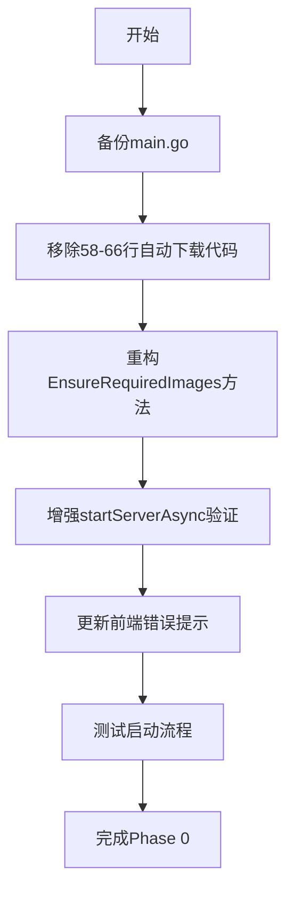
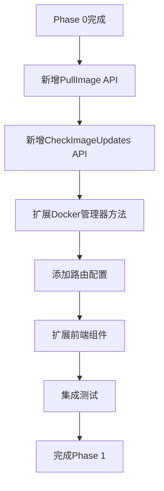
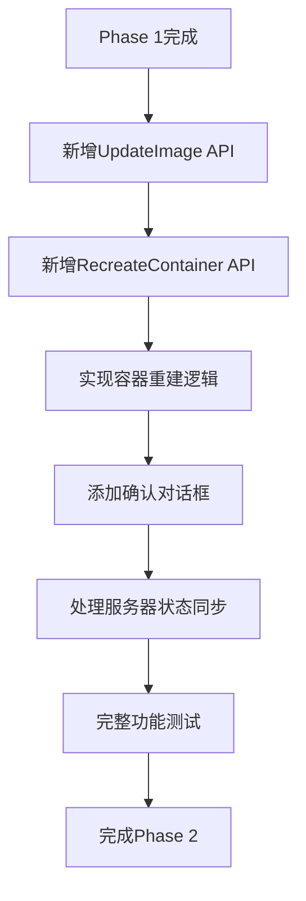

# ARK服务器管理器 - 镜像更新功能实现指南

## 📋 项目概述

基于现有的Docker镜像管理系统，重构镜像管理策略并新增镜像更新功能。该功能遵循**完全手动管理**原则，移除系统启动时的自动镜像下载，提供镜像检查、下载、更新和容器重启的完整流程管理。

## 🎯 核心目标

### 完全手动管理原则
- ❌ **移除自动下载**: 取消系统启动时的自动镜像检查和下载
- ✅ **手动触发**: 所有镜像操作（检查、下载、更新）都需要用户主动触发
- 🔒 **启动验证**: 服务器启动前必须验证必需镜像是否存在，不存在则禁止启动
- 📊 **状态监控**: 系统提供状态监控和进度反馈，但不自动执行任何下载或更新操作

## 📊 现有代码分析

### 当前实现状态
| 组件 | 文件路径 | 状态 | 说明 |
|------|----------|------|------|
| 自动下载逻辑 | [`main.go:58-66`](server/main.go:58) | ❌ 需移除 | 异步调用 `EnsureRequiredImages()` |
| 镜像检查 | [`docker_image.go:176`](server/service/docker_manager/docker_image.go:176) | ✅ 已实现 | `ImageExists()` 方法 |
| 镜像拉取 | [`docker_image.go:54`](server/service/docker_manager/docker_image.go:54) | ✅ 已实现 | `PullImageWithProgress()` 方法 |
| 状态监控 | [`docker_image.go:192`](server/service/docker_manager/docker_image.go:192) | ✅ 已实现 | `GetImageStatus()` 方法 |
| 状态API | [`routes.go:69`](server/routes/routes.go:69) | ✅ 已实现 | `/api/servers/images/status` |
| 前端状态显示 | [`ImageStatus.vue`](ui/app/components/dockerimages/ImageStatus.vue) | ✅ 已实现 | 镜像状态组件 |
| 前端模态框 | [`ImageStatusModal.vue`](ui/app/components/dockerimages/ImageStatusModal.vue) | ✅ 已实现 | 详细状态模态框 |
| 启动验证 | [`server_service.go:574-581`](server/service/server/server_service.go:574) | ⚠️ 需增强 | 基础镜像检查 |

## 🔧 技术实现方案

### Phase 0: 移除自动下载机制 *(最高优先级)*

#### 后端变更
1. **移除自动下载调用**
   - 文件: [`main.go:58-66`](server/main.go:58)
   - 操作: 删除异步 `EnsureRequiredImages()` 调用
   - 保留: Docker环境检查和状态同步

2. **重构镜像确保方法**
   - 文件: [`docker_manager.go:66`](server/service/docker_manager/docker_manager.go:66)
   - 操作: 将 `EnsureRequiredImages()` 改为 `ValidateRequiredImages()`
   - 功能: 仅检查不下载，返回缺失镜像列表

3. **增强启动验证**
   - 文件: [`server_service.go:574-581`](server/service/server/server_service.go:574)
   - 操作: 在 `startServerAsync()` 中添加严格的镜像验证
   - 逻辑: 镜像不存在时返回明确错误信息

#### 前端变更
1. **更新错误提示**
   - 文件: [`ImageStatus.vue`](ui/app/components/dockerimages/ImageStatus.vue)
   - 操作: 添加"镜像缺失，请手动下载"提示
   - 位置: 第11-16行错误状态显示区域

### Phase 1: 手动镜像管理功能

#### 新增后端API
在 [`controllers/server.go`](server/controllers/server.go) 中添加：

```go
// PullImage 手动拉取镜像
// @Summary 手动拉取Docker镜像
// @Description 用户主动触发镜像下载操作
// @Tags 镜像管理
// @Accept json
// @Produce json
// @Security Bearer
// @Param request body map[string]string true "镜像信息 {\"image_name\": \"tbro98/ase-server:latest\"}"
// @Success 200 {object} map[string]interface{} "拉取状态"
// @Router /servers/images/pull [post]
func PullImage(c *gin.Context)

// CheckImageUpdates 检查镜像更新
// @Summary 检查镜像是否有更新
// @Description 检查所有管理的镜像是否有新版本
// @Tags 镜像管理
// @Accept json
// @Produce json
// @Security Bearer
// @Success 200 {object} map[string]bool "镜像更新状态映射"
// @Router /servers/images/check-updates [get]
func CheckImageUpdates(c *gin.Context)
```

#### 新增路由
在 [`routes.go`](server/routes/routes.go) 第69行后添加：
```go
protected.POST("/servers/images/pull", controllers.PullImage)
protected.GET("/servers/images/check-updates", controllers.CheckImageUpdates)
```

#### 扩展Docker管理器
在 [`docker_image.go`](server/service/docker_manager/docker_image.go) 中添加：

```go
// CheckImageUpdate 检查镜像是否有更新
func (dm *DockerManager) CheckImageUpdate(imageName string) (bool, error)

// GetImageInfo 获取本地镜像详细信息
func (dm *DockerManager) GetImageInfo(imageName string) (*ImageInfo, error)
```

#### 前端组件扩展
1. **ImageStatus.vue 扩展**
   - 位置: 第23-33行刷新按钮区域
   - 添加: "手动下载"按钮（镜像不存在时）
   - 添加: "检查更新"按钮（镜像存在时）

2. **ImageStatusModal.vue 扩展**
   - 位置: 第142-148行footer区域
   - 添加: 镜像管理操作按钮
   - 功能: 下载、更新、检查更新

### Phase 2: 镜像更新和容器重建功能

#### 新增后端API
```go
// UpdateImage 更新镜像
// @Summary 更新Docker镜像
// @Description 更新指定镜像并处理相关容器
// @Tags 镜像管理
// @Router /servers/images/update [post]
func UpdateImage(c *gin.Context)

// RecreateContainer 重建容器
// @Summary 重建服务器容器
// @Description 使用新镜像重建指定服务器的容器
// @Tags 服务器管理
// @Router /servers/{id}/recreate [post]
func RecreateContainer(c *gin.Context)
```

#### 扩展Docker管理器
```go
// RecreateContainer 重建容器（保持现有配置）
func (dm *DockerManager) RecreateContainer(serverID uint) error

// GetContainersByImage 获取使用指定镜像的所有容器
func (dm *DockerManager) GetContainersByImage(imageName string) ([]ContainerInfo, error)

// RemoveOldImage 删除旧版本镜像
func (dm *DockerManager) RemoveOldImage(imageName string, keepLatest bool) error
```

#### 扩展服务器服务
在 [`server_service.go`](server/service/server/server_service.go) 中添加：

```go
// CheckImageUpdates 检查所有管理的镜像更新
func (s *ServerService) CheckImageUpdates() (map[string]bool, error)

// PullImage 手动拉取指定镜像
func (s *ServerService) PullImage(imageName string) error

// UpdateImage 更新指定镜像及相关容器
func (s *ServerService) UpdateImage(imageName string, userID uint) error

// GetAffectedServers 获取使用指定镜像的服务器列表
func (s *ServerService) GetAffectedServers(imageName string, userID uint) ([]ServerInfo, error)

// ValidateRequiredImages 验证启动服务器所需的镜像是否存在
func (s *ServerService) ValidateRequiredImages() (missing []string, err error)
```

#### 新增前端组件
```vue
<!-- ImageUpdateConfirmModal.vue -->
<template>
  <UModal v-model:open="isOpen" :title="$t('servers.dockerImages.updateConfirm')">
    <template #body>
      <!-- 显示影响的服务器列表 -->
      <!-- 更新风险提示 -->
      <!-- 确认操作按钮 -->
    </template>
  </UModal>
</template>
```

### Phase 3: 用户体验优化

#### 功能增强
- 添加更新历史记录
- 优化进度显示和错误处理
- 添加批量更新功能
- 镜像版本比较和回滚功能

## 🚀 实施步骤

### 步骤1: 移除自动下载 (Phase 0)


### 步骤2: 手动下载功能 (Phase 1)


### 步骤3: 更新和重建功能 (Phase 2)


## ⚠️ 风险和注意事项

### 技术风险
| 风险项 | 影响程度 | 缓解措施 |
|--------|----------|----------|
| 向后兼容性 | 中等 | 提供迁移指南，保留配置文件格式 |
| 数据安全 | 高 | 容器重建前备份数据卷，确保数据完整性 |
| 服务连续性 | 中等 | 提供维护窗口建议，支持滚动更新 |
| 网络依赖 | 低 | 添加网络检查，提供离线模式说明 |

### 用户体验风险
| 风险项 | 影响程度 | 缓解措施 |
|--------|----------|----------|
| 学习成本 | 中等 | 提供详细的用户指南和操作视频 |
| 操作复杂度 | 低 | 简化UI流程，添加一键操作选项 |
| 错误处理 | 中等 | 提供清晰的错误信息和解决建议 |

## 📝 验收标准

### Phase 0 验收标准
- [ ] 系统启动时不再自动下载镜像
- [ ] 镜像缺失时服务器启动失败并显示明确错误
- [ ] 现有功能不受影响（服务器管理、配置等）

### Phase 1 验收标准
- [ ] 用户可以手动触发镜像下载
- [ ] 下载进度实时显示
- [ ] 可以检查镜像更新状态
- [ ] 前端界面友好易用

### Phase 2 验收标准
- [ ] 可以更新现有镜像
- [ ] 容器重建保持原有配置
- [ ] 显示影响的服务器列表
- [ ] 更新过程可以回滚

### Phase 3 验收标准
- [ ] 批量操作功能完善
- [ ] 更新历史可查询
- [ ] 错误处理机制完善
- [ ] 用户体验流畅

## 🔗 相关文件索引

### 后端核心文件
- [`main.go`](server/main.go) - 应用入口，需移除自动下载
- [`docker_manager.go`](server/service/docker_manager/docker_manager.go) - Docker管理核心
- [`docker_image.go`](server/service/docker_manager/docker_image.go) - 镜像操作方法
- [`server_service.go`](server/service/server/server_service.go) - 服务器业务逻辑
- [`server.go`](server/controllers/server.go) - API控制器
- [`routes.go`](server/routes/routes.go) - 路由配置

### 前端核心文件
- [`ImageStatus.vue`](ui/app/components/dockerimages/ImageStatus.vue) - 镜像状态组件
- [`ImageStatusModal.vue`](ui/app/components/dockerimages/ImageStatusModal.vue) - 镜像状态模态框
- [`servers.vue`](ui/app/pages/servers.vue) - 服务器管理页面

### 配置和工具文件
- [`docker-compose.yml`](docker-compose.yml) - Docker编排配置
- [`package.json`](ui/package.json) - 前端依赖配置

---

**最后更新**: 2025-01-18  
**版本**: v2.0  
**状态**: 待实施
